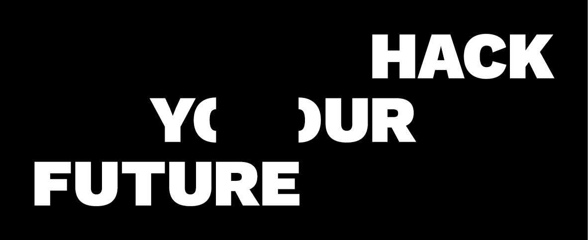

# CLASS06 - FINAL PROJECT

Main repository for the final project for Class 06



## Wireframe design

Check this link to see the current wireframes. They will be updated as we go, so keep checking in to keep track of changes: [https://freehand.invisionapp.com/freehand/document/Inhk3GUTr](https://freehand.invisionapp.com/freehand/document/Inhk3GUTr)

## Working Agreement

[WorkingAgreement.md](./WorkingAgreement.md)

_“Working agreements are guidelines that define how groups want to work together, and what they want in the working environment and from each other to feel safe and free to learn, explore and discover.”_

Read the agreement and live up to it. Your project and team work has to have rules so you develop and communicate in the same way and follow up on each others work! **A finished project is only a sucesss if you did it together and learned together.**

Feel free to review the points and contribute/pull request with new ones.


## The Customer - HackYourFuture Copenhagen 

#### HackYourFuture Copenhagen is a non-profit that aims to train refugees and asylum seekers to become web-developers and empower them by opening the doors to a very in-demand job market.


## The Project Description

### Problem description
Having an overview of the classes is difficult: Here are some of the topics that are difficult to find out:
Who are the students in the class.
What mentors are teaching what modules.
When will a class finish with the final project.
When are there holidays.
What about HackYourFuture events?

Some of this information is stored in slack, some of it is stored in google spreadsheet, some of it is stored in github and so on. 

BUT IMAGINE A WORLD where all of this information is centrally stored:


## Work stories

### Iteration 1

##### 1A: 
##### 1B: 
##### 1C: 
##### 1D: 

### Iteration 2

###### Please check the JSON files provided through APIs

API for Classes
API for Mentors 
API for Modules 
API for Students
API for Events 

## Class Daily Agenda

```
12:00 - 13:30 - Home work review and feature freeze for 
                the previous sprint;
13:30 - 14:00 - Presentation of the next sprint;
14:00 - 14:30 - Lunch;
14:30 - 16:00 - Start of the next sprint.
```

## Process

We suggest the following process for working on the project:

1. Understand the product. Why is it necessary? What does it do and how does it do it?
2. Decide on what your architecture will look like. This is mostly given, since all classes have been focusing on a single type of architecture, but make sure you understand what you are building and why you are building it.
3. Get a simple "hello world" style of prototype running utilizing the entire stack (i.e. have the React application query the API that will return a string of text fetched from the database). Don't try to implement the actual application yet. Make sure that functionality such as connecting to the database is
4. Break the UI into a component hierarchy.
5. Design a data-model for your database that will allow you to store and query the data you need.
6. Build a migration script that will allow you to easily set up any tables you need in your database and fill it with test data.
7. Build a static version of the UI. Don't worry about functionality yet. If you discover discrepancies in your component break-down as you build, update the breakdown.
8. Start thinking about what components should be stateful. Add container components as needed.
9. Start wiring up all of the functionality, fetching the data from the API and implementing real functionality as opposed to having just static components.
10. Plan development so you can stop developing any new features in the last 10-15% of the project (4-6 days). Use this time as a "feature freeze" period, where you focus on "hardening" the product by testing and fixing bugs.

## Working with GIT and handing in iterations

We expect to see running code at a regular frequency, so the product has been broken up into iterations. You are expected to finish approximately one iteration per week. We expect to see each iteration as a _pull request_ on github so we can give you feedback directly in code.

To hand in and get feedback on your iterations you must follow this process for working with git and github:

- _One_ member in each group must make a fork of the [original repository](https://github.com/HackYourFuture-CPH). A fork means that you are making a copy of the repository on your own github profile.
- The member who has made that fork must go to settings and add his team members and the mentors as collaborators
- Whenever you start working on an iteration make a new branch from the master branch and name it accordingly (ì.e. `iteration-1`)
- It is recommended that each team member make a branch off of the `iteration-1` branch and name it based on the work he or she is going to be doing (i.e. `work-story-1a-api-endpoints` if you are going to be working on API endpoints for the work story 1A)
- When you have managed to make the new code work on your local computer, commit your work to your personal branch and push it to github.
- In the github interface find your personal branch and make a pull request towards the `iteration-1` branch. Share the link with your team member(s) and ask for feedback.
- All team members should read through pull requests from other members and do as much as they can in terms of asking questions and researching in order to understand what other members have done. The team members should perform a review and either approve or request changes to the code before it can be merged.
- Once the other team members have reviewed the pull request, go to the github interface and merge the pull request.
- Once you have an iteration ready and need feedback from the mentors, make sure all work is merged to the `iteration-1` branch and then create a pull request towards the `master` branch. Post the pull request link in the main Slack channel.

To get feedback before a sunday session, pull requests must be created saturday at 12:00(midday) the latest.

If you are worried that only one member will have the project on his or her github, there is no need. People can see any contributions you make to open source repositories whether it is on your profile or not. After the project is finished we recommend that the remaining team members fork the finished repository from their teammate, to make it easier to showcase the project on their account.

## Individual tasks
In the beginning of the project students are given individual tasks. This is in part to perform research about topics relevant to the project and in part to ensure that everybody gets some work contributed early on and everyone gets to have specialty knowledge of a certain field.

### 1. Google calendar integration.

Acceptance criteria:
* Write to the google calendar.
* Read from the google calendar.
* Determine whether a user has accepted a Calendar invite.
* Try to answer whether it is feasible to store all calendar-related data in google and fetch it via the API or whether we need to have it stored locally and figure out a way to syncronize it?

Resources:
* [https://developers.google.com/calendar/](https://developers.google.com/calendar/)

### 2. Authentication
Build a prototype authentication setup using github OAuth authentication.

Acceptance criteria:
* The user should be able to register
* The user should be able to sign in
* The user should be able to log out
* When the is signed in, display the text “logged in” in the bottom of the page.

Resources:
https://developer.github.com/apps/building-oauth-apps/authorizing-oauth-apps/

### 3. Authorization
Build a prototype of the role-based logic component we need. You should not build a full authentication model, so assume that the user is already authenticated. Set up an API endpoint that will or will not show certain data based on an authentication token passed into the api determining whether the user has the required roles.

Acceptance criteria:
* Test whether admin user can read admin content, mentor content and student content
* Test that mentors cannot see admin content, but can see mentor and student content
* Test that students can only see student content

Resources:
https://medium.com/@leonardobrunolima/react-tips-how-to-protect-routes-for-unauthorized-access-with-react-router-v4-73c0d451e0a2

### 4. Research calendar react components
React Calendar Timeline looks like it will perform the job well. See how well that works for the project - if it’s not a good package try to identify another one or build it yourself.

Acceptance criteria:
* Must be able to display events in a grid-like layout
* The layout should display a row for each week. Classes are on sundays and we don’t care about the days in between sundays.

Resources:
https://www.npmjs.com/package/react-calendar-timeline

### 5. Slack integration
Research about how to make your Express server interact with Slack.

Acceptance criteria:
* User should be able to send a msg to the #general slack channel of the Slack Workplace below stated.
* If a Slack user types /echo in the #general Slack channel, the express server will respond by posting “Hello [username]” on the #general channel (username being the name of the user who posted).

Resources:
* Slack Workplace for developing - [https://hyfer-cph-test.slack.com](https://hyfer-cph-test.slack.com)
* [https://api.slack.com/docs/conversations-api](https://hyfer-cph-test.slack.com)
* [https://api.slack.com/incoming-webhooks](https://hyfer-cph-test.slack.com)
* [https://www.npmjs.com/package/react-slack-chat](https://www.npmjs.com/package/react-slack-chat)

### 6. Exporting and syncronizing calendar events
Explore how to export an Event from the APP to your own calendar iCal, Google Calendar and so on. We need events to be dynamically updated, so you may have to do some research on using CalDAV.

Acceptance criteria:
* User should be able to export a single event to his calendar.
* User should be able to export a series of events to his calendar.
* Events should update dynamically as they are changed in the application/Google Calendar.

Resources:
https://www.npmjs.com/package/react-add-to-calendar


### 7. Explore the Google Classroom API
You will need to create a fictitious organization with classes, students and mentors. Test out how everything works and build a small prototype that can pull data out of the API. We are aiming to figure out whether it would be feasible to use Google Classroom as the backend for everything related to classes, mentors and students. Administrators would have to go to Google Classroom to manage everything.

Acceptance criteria:
* We must learn whether the data stored about teachers is sufficient to support the UI we are aiming to build.
* We must learn whether the data stored about students is sufficient to support the UI we are aiming to build.
* We must learn whether the data stored about classes/modules is sufficient to support the UI we are aiming to build.
* We must learn whether we can build the proposed Calendar UI based on data from Google Classroom.
* Will using Google Classroom impose restrictions on how we authenticate the user? (i.e. must we use Google Oauth authentication?)

Resources:
* [https://classroom.google.com](https://classroom.google.com)
