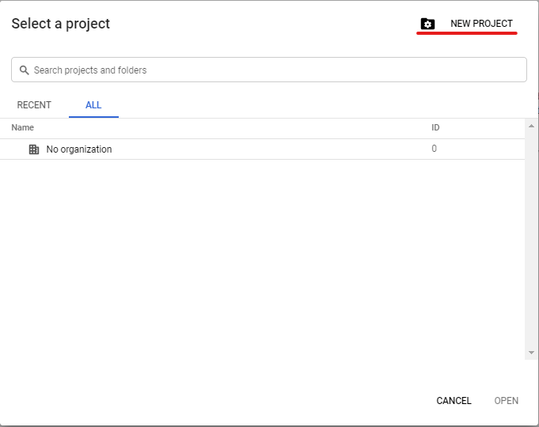
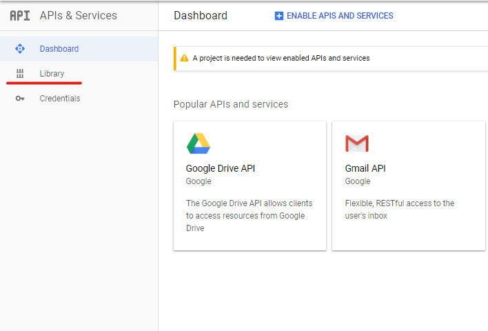
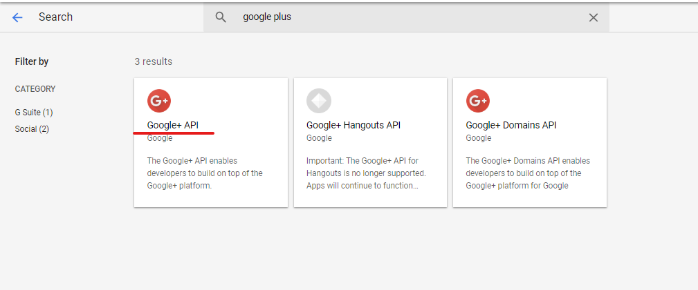
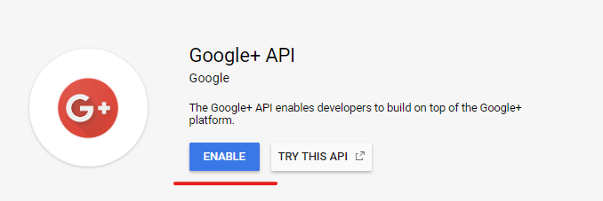
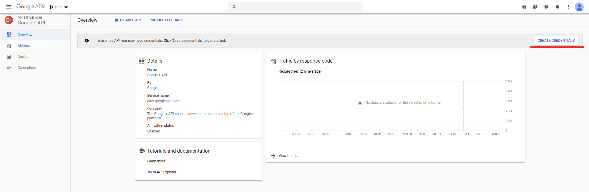
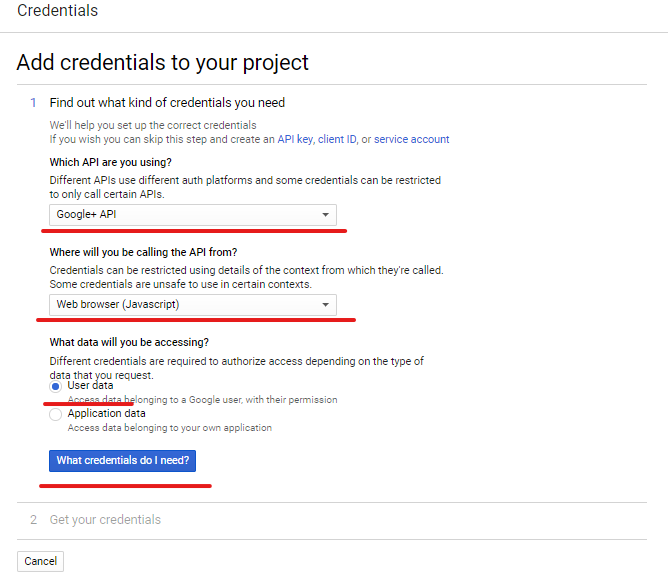
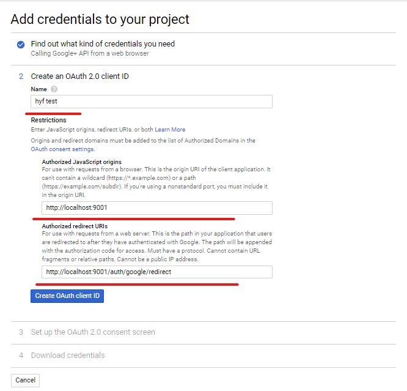
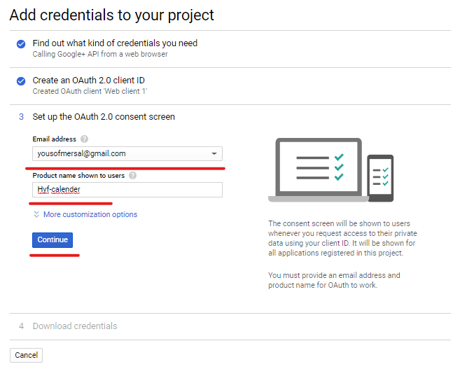
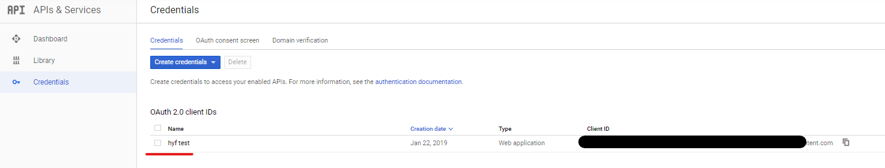
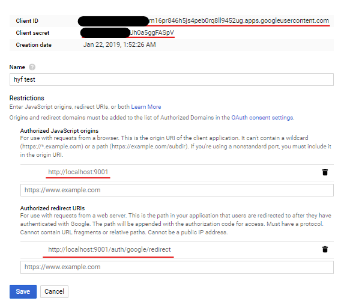

# Authorization prototype

Build a prototype authentication setup using github OAuth authentication.

Acceptance criteria:

- The user should be able to register
- The user should be able to sign in
- The user should be able to log out
- When the is signed in, display the text “logged in” in the bottom of the page.

Resources: https://developer.github.com/apps/building-oauth-apps/authorizing-oauth-apps/

## Environmental variables used.

- CALLBACK= The callback used when registering your app at OAuth2.0 provider. Also known as the redirect given you need to provide with OAUTH2.0
- DB_DATABASE= Database Name.
- DB_HOST= Database Host.
- DB_PASSWORD= Database Password
- DB_PORT= Database Port
- DB_USERNAME= Database username
- CLIENT_ID= Client ID of you get from OAuth2.0 provider.
- CLIENT_SECRET=Client Secret you get from OAuth2.0 provider.
- COOKIE_KEY=Secret string to encrypt cookie.
- RUNENV= This should be equal to `dev` if you want to develop locally so you get redirected to http://localhost:3000 instead of localhost:9000

To use .env file. create a `.env` file at project root. Then `npm install dotenv` and write `require('dotenv').config()` at the top of you server file, then make sure you have added `.env` to your `.gitignore` and then your done!

##How to get up and running.

You'll need

-node v10.15.0+
-mysql database remote or local
-a terminal/command propts

- Create a .env file inside the source folder

```
.
├── README.md
├── WorkingAgreement.md
├── images
└── source
    ├── .env <------- .env file should have this position.
    ├── README.md
    ├── config
    ├── package-lock.json
    ├── package.json
    ├── public
    ├── scripts
    └── src
        ├── client
        └── server
```

- Then fill in the mentioned .env variables mentioned in previous headline.

```
RUNENV=dev
CALLBACK=http://localhost:9001/auth/google/redirect
CLIENT_ID=123456789abcdefg.apps.googleusercontent.com
CLIENT_SECRET=123secret456key789
DB_DATABASE=hyf
DB_HOST=localhost
DB_PASSWORD=password
DB_PORT=3306
DB_USERNAME=root
COOKIE_KEY=this_string_can_be_anything
```

- Now we need to create an [OAuth api app from Google](https://console.developers.google.com)

  

- Then we need to create a project.











- You can then choose to download the information or copy paste them.
  

- Then make sure the redirect is the same and you can cope and paste client secret and the client id
  

- Then back in your project we want to chag e directorty into the source folder. `cd source`
- Then run `npm install`
- Make sure your mysql server is running
- Then change directory into the knex folder. `cd src/server/database/knex`
- Then run `knex migrate:latest`
- Then run `knex seed:run`
- Then your open terminal windows move into the server folder. `cd ../..`
- Then run the server file with node or with nodemon `node server.js` or `nodemon server.js` **make sure you are inside the server folder when you run the file!**
- Then open another terminal window and navigate into the source folder again.
- Lastly in the new terminal window run `npm start`
- You should now be able to view and demo the app and develop on it as you see fit.

- If you want to see the admin functionality, log into the app with a google account.
- After logging into the google account, run this mysql query `UPDATE users SET role_id = 1 where id = 5`
  this will give the row with id = 1 admin privleges, if you're the first to be assigned to the database which you should if you logged in succesfully you now are an admin!
